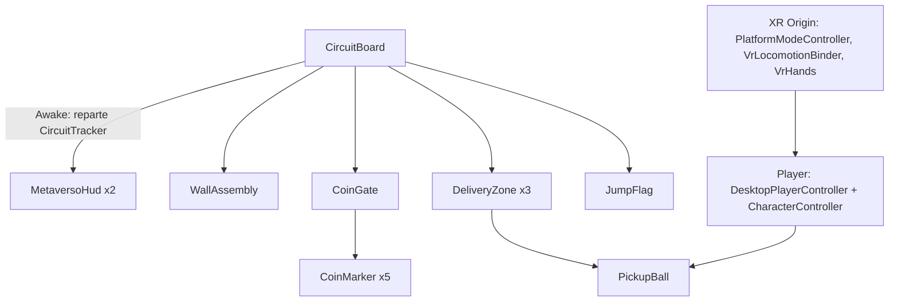
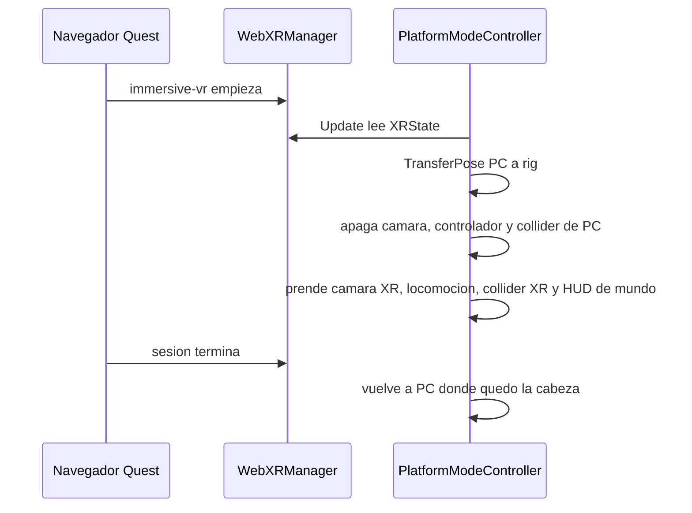

# Arquitectura

## Assemblies

Cada carpeta de `Assets/_Metaverso/Scripts` tiene su `.asmdef`. Asi el codigo de juego compila aunque falte un paquete opcional.

| Assembly | Carpeta | Depende de |
| --- | --- | --- |
| `Metaverso.Runtime` | Core, Player, World, UI, Network (sin Fusion) | Input System, Timeline, UGUI |
| `Metaverso.XR` | XR | Runtime, WebXR, XR Interaction Toolkit, XR Core Utils |
| `Metaverso.Fusion` | Network/Fusion | Runtime y `Fusion.Runtime`. Solo compila con el define `PHOTON_FUSION` |
| `Metaverso.Editor` | Editor | Runtime (solo editor) |
| `Metaverso.EditorXR` | EditorXR | Runtime, XR, WebXR, XR Management (solo editor) |
| `Metaverso.Tests.*` | Tests | Runtime + NUnit |

`Runtime` no conoce WebXR ni Photon. Si un plugin cambia, solo se toca `XR` o `Fusion`.

## Escena Circuito

- `CircuitBoard` (orden de ejecucion -100) crea el `CircuitTracker` y lo inyecta en todo lo que completa pasos. No hay referencias arrastradas en el Inspector: regenerar la escena no rompe nada.
- Todo mide distancia contra el objeto con tag `Player`. En VR ese objeto sigue a la cabeza (ver abajo), por eso monedas, pelota y muros funcionan igual en los dos modos.
- `MetaversoHud` construye su UI en `Awake`. Los listeners de botones agregados por codigo no se serializan, asi que no se puede construir en el editor. `ShowMessage` llega a todos los HUD.

## Cambio PC / VR

- Las reglas (que se prende en cada modo, como se copia la pose) estan en `Core/PlatformModeSwitch.cs`, sin dependencias de Unity XR, y tienen tests.
- `PlatformModeController` solo las aplica. Lee `WebXRManager.Instance.XRState` cada frame en lugar de suscribirse al evento, porque el evento de WebXR Export es interno en la version 0.25.
- En VR, `LateUpdate` mueve el `Player` de PC bajo la cabeza y oculta su capsula.
- `ClientModeState.Current` es el modo global para quien lo necesite (video, manos).

## Locomocion VR

- `VrLocomotionBinder` crea acciones de Input System en codigo (`<XRController>{LeftHand}/thumbstick`, etc.) y se las pasa a `ContinuousMoveProvider` y `SnapTurnProvider` de XRI 3. No depende de un `.inputactions` de ejemplo.
- `VrHands` agarra la pelota con el gatillo, la suelta con el grip y hace un teletransporte corto con el click del stick derecho. Existe porque las acciones de seleccion de XRI no vienen asignadas en un rig creado por codigo.
- El rig lo arma `EditorXR/PlayerRigBuilder.cs`. Cada mano tiene un `XRDirectInteractor`; el `XRRayInteractor` va en un hijo porque Unity permite un interactor por objeto.

## Red

- `NetworkBootstrap` deja una `OfflineSession` con la sala de `?room=`.
- Con Photon importado y `PHOTON_FUSION` activo, `FusionSession` entra en Shared Mode a esa sala y hace spawn del `NetworkAvatar`.
- `NetworkAvatar` copia la `PoseSource` activa (cabeza y manos en VR, camara en PC). El duenio escribe, el resto interpola en `Render`.
- `NetworkPickupState` replica la pelota; quien la toma pide `StateAuthority`.

## Build web

- `Editor/WebBuildPipeline.cs` estampa `Resources/BuildInfo.asset`, compila dos variantes (`desktop` y `quest`) y escribe `metaverso-web/docs/index.html`, que redirige segun el user agent. Entre variantes el editor recarga: cambiar DXT/ASTC deja un domain reload pendiente y el player no se puede compilar hasta que termina.
- `Editor/BuildSizeCheck.cs` corta el build si el `.data` supera 50 MB.
- `Plugins/WebGL/MediaOverlay.jslib` abre el video en un iframe HTML encima del canvas (solo PC).

## Donde tocar para...

| Quiero | Archivo |
| --- | --- |
| Cambiar pasos del circuito | `World/CircuitBoard.cs` |
| Cambiar velocidad o salto en PC | `Player/DesktopPlayerController.cs` (o el Inspector) |
| Cambiar velocidad o giro en VR | `XR/VrLocomotionBinder.cs` |
| Cambiar el presupuesto Quest | `Core/QuestBudget.cs` |
| Cambiar que se aplica al importar modelos | `Editor/ArchModelPostprocessor.cs` y `Editor/ArchModelMenu.cs` |
| Agregar un paso al build | `Editor/WebBuildPipeline.cs` |
